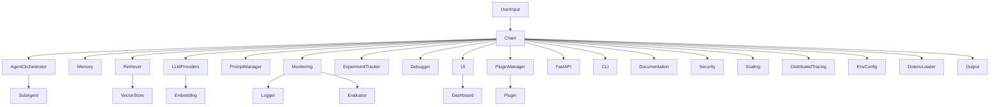
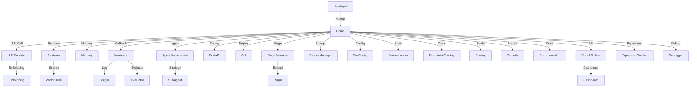
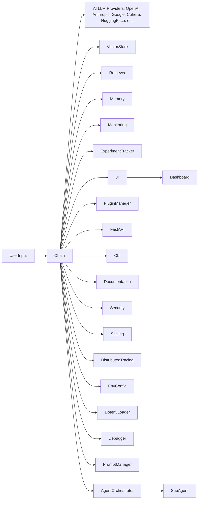

## 🔄 Chain Execution Flow



# LLMChain: Professional Modular AI Framework

LLMChain is a professional, modular framework for building advanced LLM-powered applications and agents. It offers robust orchestration, broad AI provider support, compositional chains, memory, retrievers, monitoring, experiment tracking, enterprise features, and a modern UI.

---

## 🚀 Key Features

- **Modular Chains**: Compose flexible workflows (QA, summarization, map-reduce, sequential, multi-prompt, etc.)
- **Agent Orchestration**: Pluggable strategies, subagents, voting, cascading, and more
- **AI LLM Providers**: OpenAI, Anthropic, Google, Cohere, HuggingFace, DeepSeek, Groq, Ollama, Mistral, Azure, VertexAI, Replicate, Fireworks, Together, Perplexity, MosaicML, PaLM, Bedrock, SageMaker, Clarifai, Petals, AlephAlpha, Forefront, Writer, Yandex, Baidu, Qianfan, Zhipu, Baichuan, ERNIE, Spark, DashScope, Moonshot, Zero, Qwen, Yi, MiniMax, DeepInfra, BaiduCloud, SparkDesk, BaiduWenxin, ErnieBot, Baichuan2, Qwen2, Yi1, Yi34, MiniChain, Moon
- **Embeddings & Vector Stores**: In-memory, semantic, Chroma, Pinecone, Weaviate, and more
- **Retrievers**: Simple, multi-query, document compression, rerankers, conversational QA
- **Memory**: Generic, chat, episodic, retrieval-augmented
- **Prompt Engineering**: Templates, manager, multi-prompt routing
- **Monitoring & Evaluation**: Logger, evaluator, experiment tracker, distributed tracing
- **Enterprise Features**: Security, scaling, environment config, .env loader
- **UI Tools**: Visual chain builder, dashboards
- **Plugin System**: Extend with custom tools, retrievers, chains
- **Production Deployment**: FastAPI server, CLI, Docker
- **Comprehensive Documentation**: API reference, tutorials, migration guides

---

## 🏗️ Architecture Diagram



---


## 🤖 AI LLM Providers & Workflow



---

## ⚡ Quick Start

1. Install dependencies:
   ```bash
   pip install fastapi openai
   ```
2. Run the FastAPI server:
   ```bash
   python llmchain/deployment/server.py
   ```
3. Use the CLI:
   ```bash
   python llmchain/deployment/cli.py "Your prompt here"
   ```

---

## 🧩 Ecosystem & Extensibility

- Add new LLM providers, retrievers, vector stores, plugins, and chains easily
- Integrate with enterprise features, monitoring, and experiment tracking
- Visual builder and dashboard for rapid prototyping
- Comprehensive API reference and tutorials

---

## 🤝 Contributing

- Fork the repo, create a branch, and submit a pull request
- Add tests for new features
- Follow the modular structure for new components
- See CONTRIBUTING.md for details

---

## 🌐 Community

- Issues and discussions are welcome on GitHub
- Contributions, feedback, and feature requests encouraged

---

## 📄 License

MIT License
